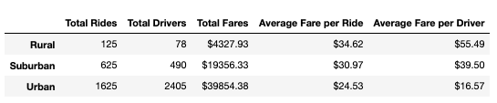
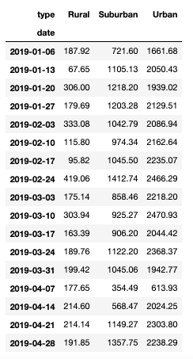
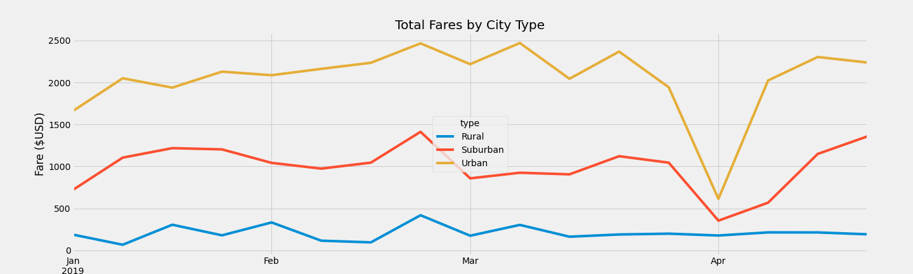

# PyBer Analysis

## Overview
PyBer, a ride sharing app, wants to improve access to ride sharing services and determine affordability for underserved neighborhoods. With the PyBer city and ride data provided I examined the total rides, total drivers, total fares, average fare per ride and driver, and total fare by city type to determine the key difference in ride sharing based on city type. The differences in urban, suburban, and rural outcomes can be used by decision-makers at PyBer to improve services.

Link to city and ride date: https://github.com/mirandawylie/PyBer_analysis/tree/main/resources

Link to Jupyter notebook: https://github.com/mirandawylie/PyBer_analysis/blob/a5c58a4787c9ce960e19df404e75352c21fdc2c7/PyBer_Challenge.ipynb

## Results
When dividing up the total rides, total drivers, total fares, average fare per ride and driver by rural, suburban, and urban city types the ride-sharing data shows that:

* rural cities use ride-sharing the least, urban cities use 
* ride-sharing the most* rural cities have the highest average fare per ride and driver
* urban cities have the highest total fares and yet the least average fare per ride and driver
* rural cities have a ratio of 1 driver to 1.6 rides
* suburban cities have a ratio of 1 driver per 1.27 rides
* urban cities have a ration of 1 driver per .67 rides

By resampling the data frame by week, I was able to create a multiple-line chart to show the total fares for each week by city for the date range January 1st, 2019 through April 29th, 2019.

When looking at the data in this chart one can begin to narrow in on the peaks and dips of ride-sharing per city and time of year. Some similarities, like all cities experiencing an increase in ride sharing at the end of February, are worth noting for any potential company wide changes.

## Summary
Based on the analysis, I recommend an increase in the urban driver's rate to account for the stark disparity between average rate per drivers among city type. Ride sharing access to rural communities would be better served with a decreased average fare per ride. The suburban market could be further capitalized by recruiting more drivers and expanding marketing efforts to increase ride-sharing in the community.